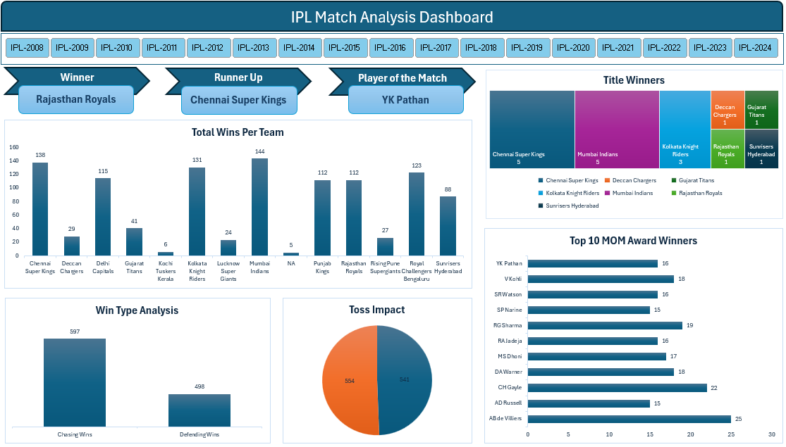

# IPL Match Analysis Dashboard
*Interactive Excel dashboard showcasing IPL match insights through data cleaning, modeling, and visualization.*

## 📌 Project Overview
This project analyzes IPL match data (2008–2024 seasons) using Excel.  
It includes data cleaning, transformation, and interactive dashboard creation.

## 🛠 Tools & Skills Used
- Microsoft Excel (Power Query, Pivot Tables, Charts)
- Data Modeling & Cleaning
- Dashboard Design & Visualization

## 🔑 Key Insights
- Team performance comparisons
- Toss impact on match outcomes
- Win type trends (runs vs wickets)
- Player of the Match analysis

## 📊 Dashboard Highlights
- KPIs for runs, wickets, and margins
- Interactive treemaps and charts
- Season‑wise breakdown of results
- User‑friendly visuals for quick insights

## 📁 Files Included
- `IPL_Match_Analysis_Dashboard.xlsx` → Contains both the dataset and the interactive dashboard
- `screenshots/dashboard_overview.png` → Folder with dashboard images

## 📸 Dashboard Screenshot

## 🚀 How to View
1. Download the Excel file from this repo.
2. Open in Excel (2016 or later recommended).
3. Navigate through the dashboard tabs to explore interactive visuals.

## 👤 Author
**Nirav Prajapati**  
**Data Analyst**
